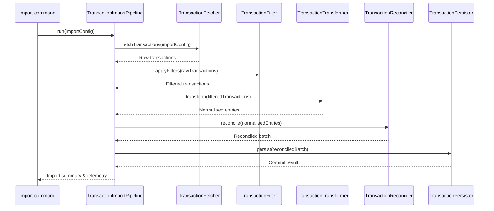

# ADR: Transaction Import Pipeline Architecture

## Status

Proposed

## Context

The legacy `Importer.importTransactions` method has grown to encompass fetch, filter, transform, reconciliation, and persistence logic with tightly coupled dependencies on the Actual API client and CLI command scaffolding. This coupling makes it hard to reason about stage-level side effects, reuse components in new features (multi-budget sync, category translation), and keep automated tests focused.

## Decision

We will introduce a `TransactionImportPipeline` orchestrator that coordinates explicit stage interfaces to isolate responsibilities and enable targeted testing.

### Architecture overview

The pipeline will execute the stages in order, injecting shared dependencies (logger, configuration, Actual API client) and passing a mutable context object that carries both source data and intermediate artefacts.

### Naming rationale

- **TransactionImportPipeline** emphasises orchestration and aligns with other pipeline-based modules in the repo (`BudgetSyncPipeline`).
- Stage helpers follow the `Transaction<Stage>` convention (`TransactionFetcher`, `TransactionFilter`, etc.) to keep their purpose unambiguous.
- Public methods adopt verb-based names (`fetchTransactions`, `applyFilters`, `transform`, `reconcile`, `persist`) to read clearly inside the orchestrator.

### Stage contracts

| Stage | Responsibility | Input | Output |
| --- | --- | --- | --- |
| `TransactionFetcher` | Retrieve MoneyMoney transactions for the configured accounts and timeframe. | `ImportConfig`, Actual API client, logger | Array of raw MoneyMoney transactions |
| `TransactionFilter` | Remove ignored transactions, deduplicate, and enforce earliest import date. | Raw transactions, ignore rules, logger | Array of filtered transactions |
| `TransactionTransformer` | Convert raw transactions into Actual-ready entries including payee/category transformations. | Filtered transactions, mapping config, logger | Array of normalised transaction DTOs |
| `TransactionReconciler` | Compare normalised entries against existing Actual data to determine inserts vs updates. | Normalised transactions, Actual API client | Reconciled batch with actionable operations |
| `TransactionPersister` | Apply reconciled operations to Actual and produce telemetry. | Reconciled batch, Actual API client | Persistence result summary |

### Migration notes

1. Introduce interfaces for each stage (`TransactionFetcher`, etc.) that accept dependencies via constructor or function parameters to keep them testable.
2. Incrementally move existing logic out of `Importer.importTransactions`, stage by stage, ensuring each refactor is covered by unit tests before proceeding.
3. The orchestrator should default to a pass-through context until each dedicated stage is implemented, enabling partial migrations without breaking behaviour.
4. Update CLI integration tests after all stages land to validate dry-run/live parity and error messaging.

## Consequences

- **Positive:**
  - Lower cognitive complexity in `Importer.importTransactions`.
  - Stage-level tests provide faster feedback for regressions.
  - Future features can reuse the pipeline stages independently.
- **Negative:**
  - Requires initial refactor investment and coordination across multiple PRs.
  - Additional interfaces increase the number of files but improve clarity.

## Alternatives Considered

- **Status quo:** Maintain the monolithic importer. Rejected because it perpetuates high complexity and hinders future enhancements.
- **Inline helper functions:** Extract helpers within the same file without formal stages. Rejected because it does not provide explicit contracts or enable reuse across commands.
